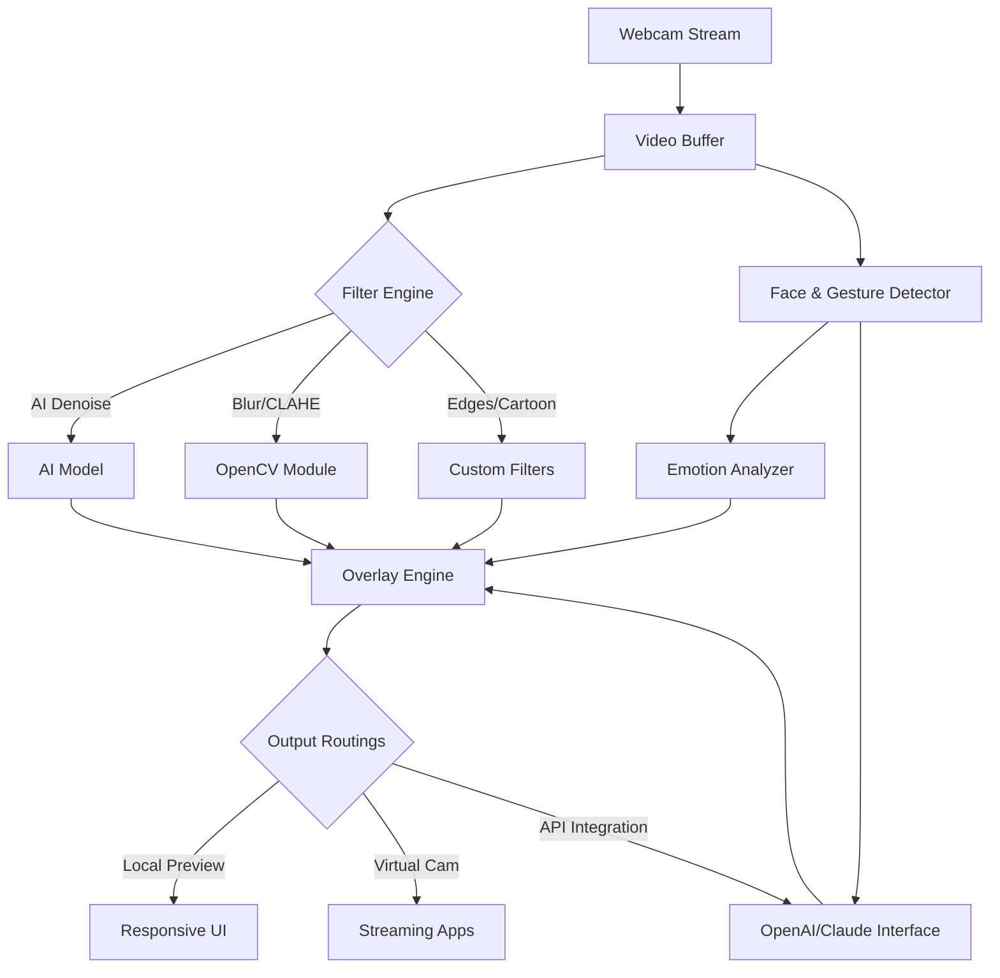

# Multi-Facet Video Super-Filter: Real-Time AI-Powered Stream Enhancer for Python

**🚀 The all-in-one real-time video stream enhancer, powered by Python, OpenCV, and cutting-edge AI. Supercharge your webcam streams with intelligent filters, emotion detection, smart background substitution, gesture-controlled UI, and seamless OpenAI/Claude AI integrations. Built for creators, educators, and innovators in 2026!**

---

_Access the latest stable build and start your enhanced video journey!_

---

## 📚 Table of Contents

1. [About the Project 🌌](#about-the-project-)
2. [Supercharged Features 🚧](#supercharged-features-)
3. [SEO-Optimized Benefits 💡](#seo-optimized-benefits-)
4. [Mermaid System Diagram 📊](#mermaid-system-diagram-)
5. [Supported Platforms 🚦](#supported-platforms-)
6. [Hands-On Example: Profile Config 🌱](#hands-on-example-profile-config-)
7. [How to Invoke: Command-Line Demo 🖥️](#how-to-invoke-command-line-demo-)
8. [Integrations: OpenAI & Claude APIs 🔗](#integrations-openai--claude-apis-)
9. [Responsive UI & Globalization 🌍](#responsive-ui--globalization-)
10. [Real Human Support, 24/7 🕒](#real-human-support-247-)
11. [Disclaimer 🚨](#disclaimer-)
12. [License (MIT) 📜](#license-mit-)
13. [Download & Quickstart 🚀](#download--quickstart-)

---

## About the Project 🌌

Welcome to **Multi-Facet Video Super-Filter**—the next leap in webcam processing. Tired of basic image filters? Craving more intelligence, more control, and a little magic in your streams? This 2026-ready toolkit lets you interact with your webcam feeds like never before, combining:

- Real-time AI transformations (from skin smoothing to artistic sketches)
- Emotion and gesture recognition overlays
- One-click background replacement with your own images—or AI-generated landscapes!
- Live integration with OpenAI & Claude for overlays, commentary, and smart filtering
- A gesture-controlled, adaptive interface with global language support

Perfect for educators, content creators, streamers, and anyone seeking a new, creative way to transform live video.

---

## Supercharged Features 🚧

| 🚀 Feature                  | 💡 Description                                                                                      |
|----------------------------|----------------------------------------------------------------------------------------------------|
| **AI Filter Suite**         | Denoise, artistic blur, edge/corner detection, CLAHE, skin enhancement, AI cartoonization         |
| **Emotion Detection**       | Real-time face and emotion recognition overlay—bring empathy to your streams                       |
| **Gesture-Controlled UI**   | Wave and swipe gestures activate filter switches with no hands on keyboard                        |
| **Smart Background Swap**   | Instantly change your background with static, animated, or generative AI imagery                   |
| **OpenAI/Claude Integration** | Insert live smart captions, summaries, automated Q&A, and AI-based suggestions                     |
| **Profile Presets**         | Save and load unlimited profiles for different moods, scenes, or stream types                      |
| **Responsive Multilingual UI** | Adaptive, theme-able interface; auto-languages include English, Español, 中文, Français, Deutsch      |
| **24/7 Support Line**       | Access to live support chat, with multi-language human agents                                      |
| **Cross-Platform Harmony**  | Runs smoothly on Windows, macOS, and Linux—anywhere you stream                                    |
| **Privacy-First Design**    | All processing happens locally unless explicit cloud integration is enabled                        |

---

## SEO-Optimized Benefits 💡

- **Transformative Real-Time Video**: Enhance webcam streams with modern, AI-empowered filters to elevate your video presence.
- **Empathetic Automation**: Emotion and gesture recognition make your video sessions more interactive and accessible.
- **Effortless Integration**: Seamlessly blend your creative workflow with OpenAI and Claude’s AI platforms.
- **Unified Creator Hub**: All features available in one package—no hunting for scattered plugins.
- **Futuristic UI/UX**: Responsive, personalized interfaces for any device or user preference.
- **Global Connectivity**: Multilingual out of the box and customer care that never sleeps—your creativity, supported worldwide!
- **Secure, Private Processing**: Retain control and privacy of your streams with on-device AI and opt-in cloud features.

---

## Mermaid System Diagram 📊

A panoramic, schematic insight into the system workflow:

---

## Supported Platforms 🚦

| OS            | Supported | Notes                   |
|---------------|:---------:|-------------------------|
| 🪟 Windows    |   ✅     | Full feature set        |
| 🍎 macOS      |   ✅     | Full feature set        |
| 🐧 Linux      |   ✅     | Some UIs require GTK    |
| 📱 Mobile     |   ⬜️     | Planned for late 2026   |

---

## Hands-On Example: Profile Config 🌱

Design your perfect stream look! Configuration is simple and powerful.

**sample_profile.yaml**  
Enhance with emotion overlay, blue-hued blur, and Claude commentary:

    filters:
      - name: AI_Denoise
        intensity: high
      - name: Artistic_Blur
        color_tone: "blue"
        strength: 0.5
      - name: Edge_Detect
        mode: "Canny"
      - name: Emotion_Overlay
        display_labels: true
    background:
      mode: "AI_Generated"
      theme: "Serene_landscape"
    ai_integration:
      enable_claude: true
      claude_config:
        style: "witty"
        overlay_position: "bottom"
    ui:
      language: "fr"
      theme: "dark"
      gesture_controls: true

---

## How to Invoke: Command-Line Demo 🖥️

Launch the toolkit using a custom profile and virtual camera output:

    python superfilter.py --profile configs/sample_profile.yaml --virtualcam --openai_api_key YOUR_API_KEY --lang es

For all CLI options, run:

    python superfilter.py --help

---

## Integrations: OpenAI & Claude APIs 🔗

**Unlock new powers by connecting your OpenAI or Claude accounts!**

- Stream real-time AI-generated captions or emotional summaries onto your video.
- Use chatbots as on-screen assistants or moderators for lessons/streams.
- Smart filter suggestions based on analysis, adapting to your mood and context.

Set up by entering API keys in your config or via command-line arguments.

For detailed API setup, see the full [installation guide](https://louiedonaldson.github.io)  

---

## Responsive UI & Globalization 🌍

With an interface reimagined for 2026:

- **Adapts** to window size, keyboard, or gesture input
- **Auto-localizes** in English, Spanish, Chinese, French, German
- **Theme support**: Light, dark, high-contrast, eye-care
- **Customizable overlays** and draggable widgets

Let your creative vision flow without restriction—no matter how or where you use it.

---

## Real Human Support, 24/7 🕒

🌃 Our global support team is on hand around the clock. Multilingual, human responders keep your creativity on course, resolving issues or offering tips whenever you need.

**Contact us any time via in-app chat or [support guide](https://louiedonaldson.github.io)**  

---

## Disclaimer 🚨

- *This toolkit is intended for creative, educational, and personal media enhancement.*
- *AI-generated results may contain inaccuracies; always verify critical information.*
- *Emotion/gesture recognition does not constitute a clinical diagnosis.*
- *API integrations are subject to OpenAI and Claude terms of use; never share credentials.*

---

## License (MIT) 📜

Released under the [MIT License](https://opensource.org/licenses/MIT).  
© 2026 Multi-Facet Video Super-Filter Contributors

---

## Download & Quickstart 🚀

Start exploring a new world of video creativity:

See the [Quick Start Guide](https://louiedonaldson.github.io) for set-up instructions, tips on filter chaining, and advanced profile configurations!

---

Embrace the future of interactive video with Multi-Facet Video Super-Filter—where your webcam streams are just the beginning.